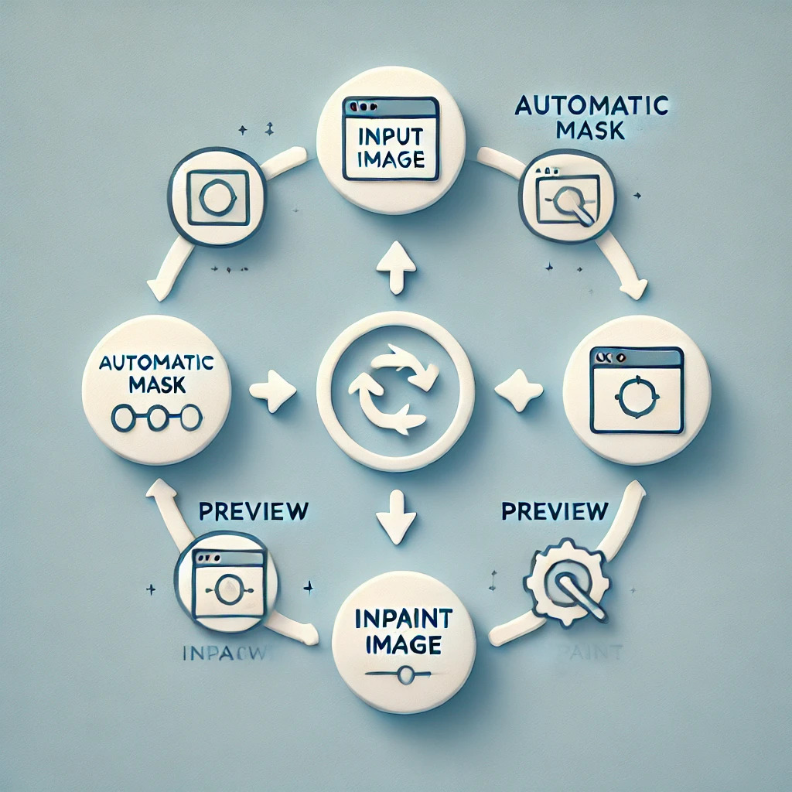
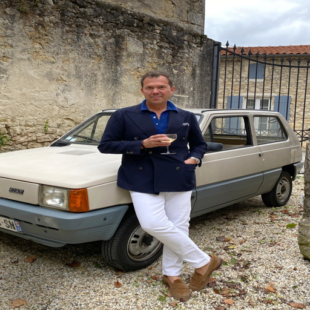
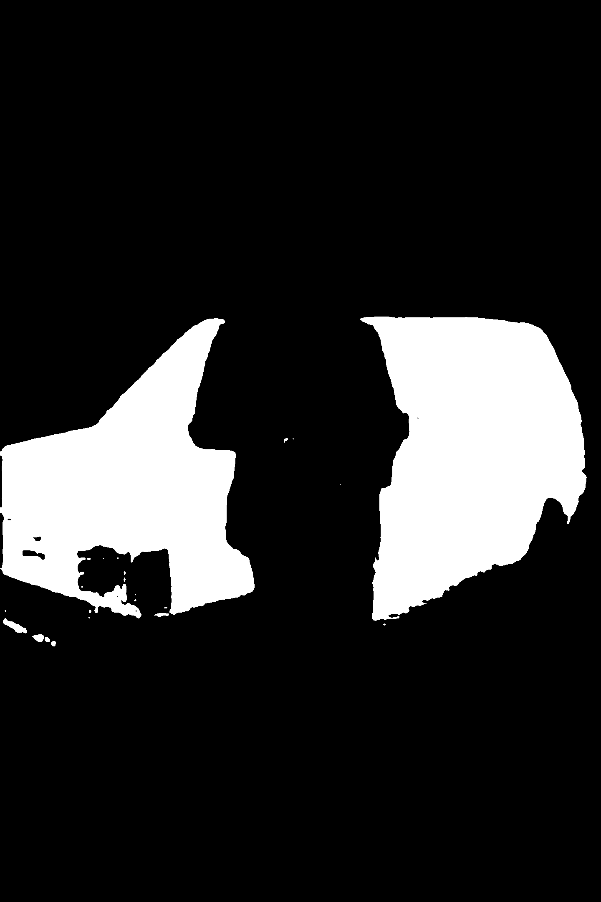
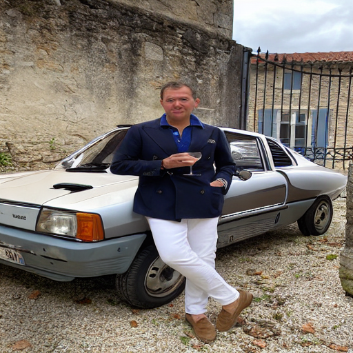
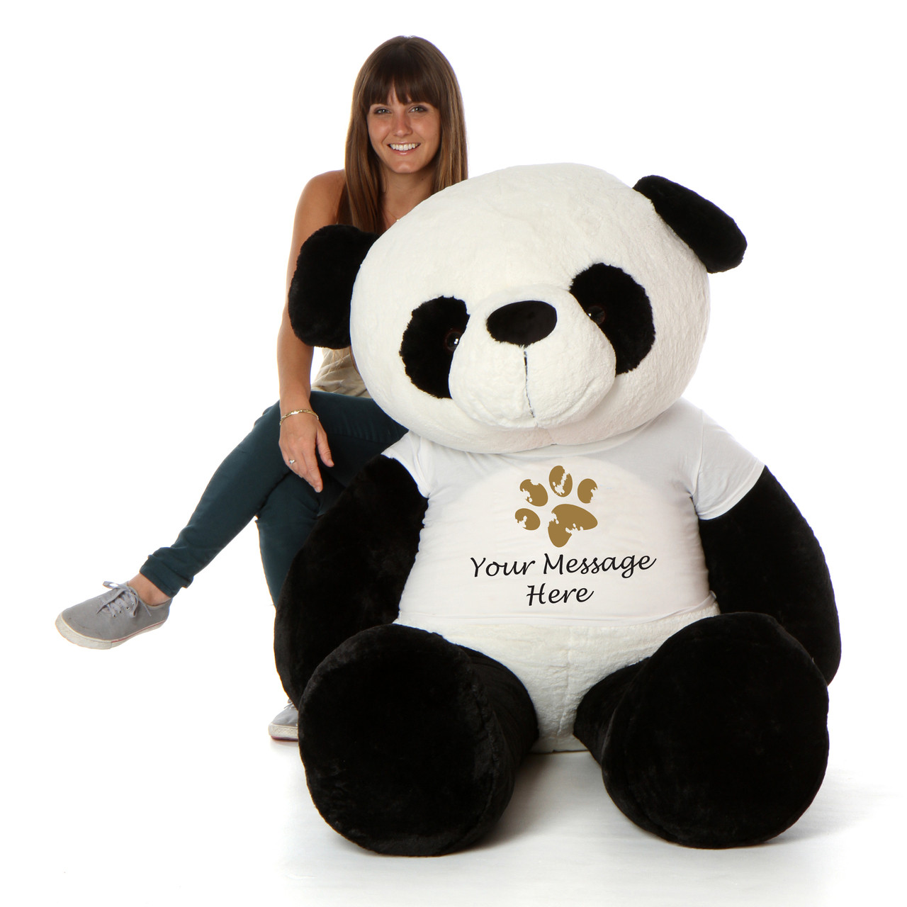
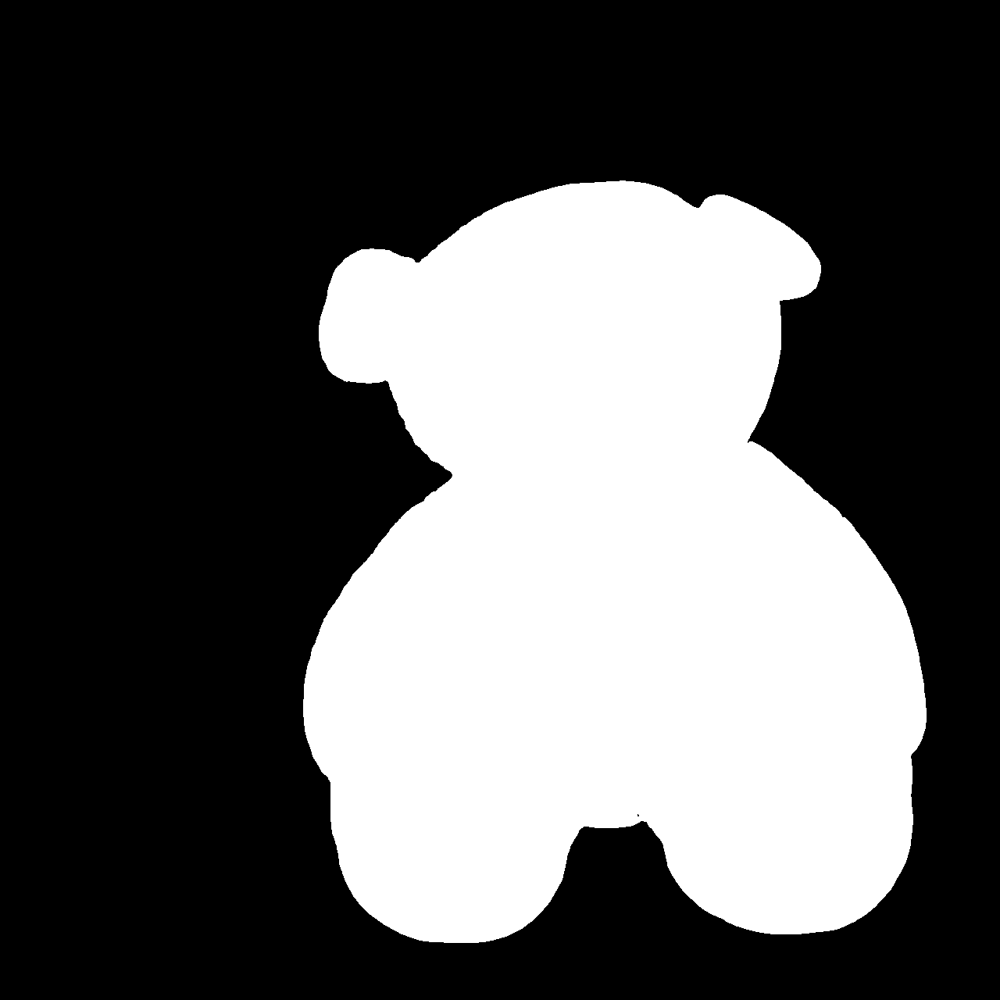
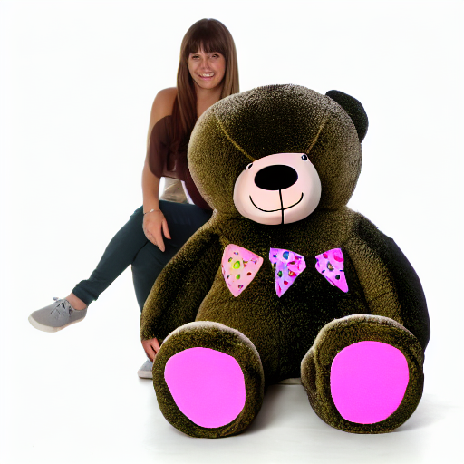

# Automatic Masking and Inpainting with Stable Diffusion

This repository contains a Python notebook that demonstrates automatic image masking using the **Segment Anything Model (SAM) and You Only Look Once (YOLO)** and inpainting using the **Stable Diffusion Inpainting pipeline**. The project showcases how cutting-edge AI models can be used to mask objects in an image automatically and fill in the masked regions using context-driven prompts.

---

https://github.com/user-attachments/assets/cc41f621-afde-4392-a6ad-c16a079372b6

---

## Overview

### Objectives:
- Automatically mask objects in an image using SAM and YOLOv8.
- Perform inpainting to replace masked regions with contextually accurate content using Stable Diffusion.
- Provide a user-friendly pipeline for both technical and non-technical users.

---

## Getting Started

Just run the following notebook :- https://colab.research.google.com/drive/1-VOQ2ziByv3WL6SSOPopLn2OLEUdsc5i?usp=sharing

---

## Workflow

1. **Input Image**: The user provides an image that requires masking and inpainting.
2. **Automatic Masking**: 
   - YOLOv8 detects objects in the image.
   - SAM generates masks for the detected objects.
3. **Image Preview**:
   - The notebook displays the original and masked images side by side.
4. **Inpainting**:
   - Using the Stable Diffusion Inpainting pipeline, the masked regions are filled based on a user-provided prompt.

---

## Examples

### Input Image:

### Masked Image prompt (Car):

### Inpainted Image with prompt (supercar):

---

### Input Image:

### Masked Image prompt (teddy bear):

### Inpainted Image with prompt (happy brown bear) :

---

### Input Image:

### Masked Image prompt (laptop):

### Inpainted Image with prompt (Newspaper) :

---

## Limitations

YOLOv8 is a powerful object detection model trained on datasets like COCO (Common Objects in Context), which contains annotations for 80 common object categories. However, its performance is inherently limited to the categories defined in the COCO dataset. This means YOLO cannot identify objects or concepts outside this predefined set. For example, it may fail to recognize specific industry-specific items, rare objects, or detailed subcategories.

Additionally, YOLO's accuracy may be affected by variations in lighting, object occlusion, or unconventional angles, leading to false negatives or misclassifications.

### Examples of COCO Keywords:
- Person
- Bicycle
- Car
- Dog
- Cat
- Chair
- Bird
- Backpack
- Bottle
- Keyboard

These limitations should be considered when choosing YOLO for applications that require detecting highly specific or uncommon objects.

